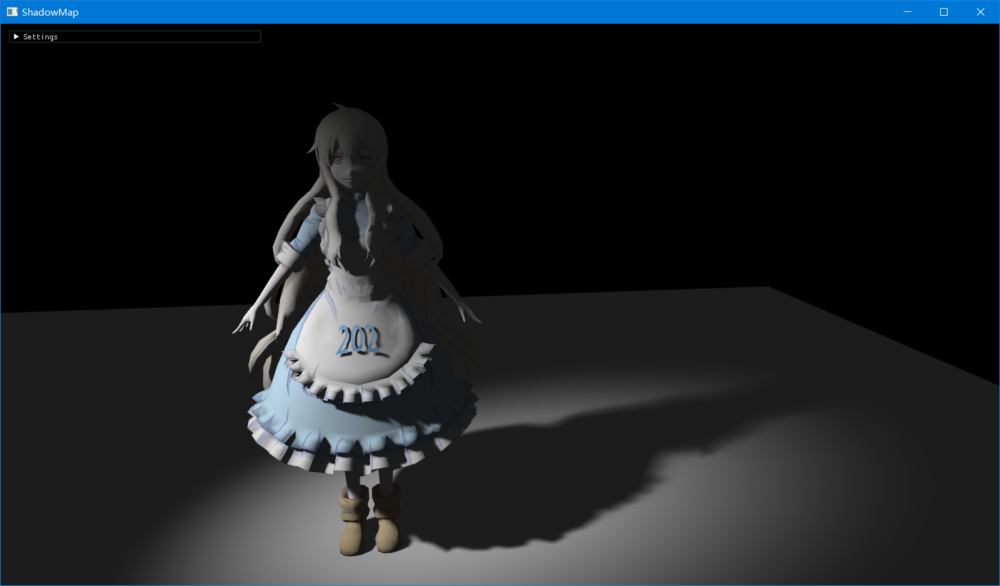
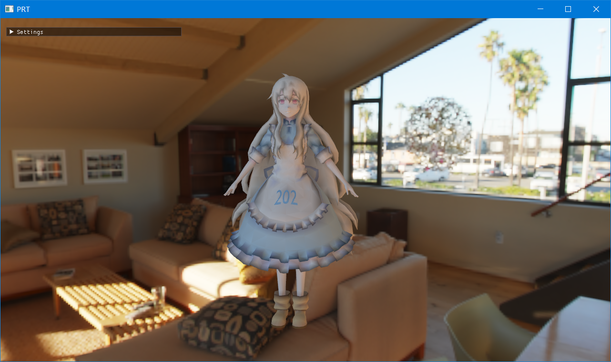
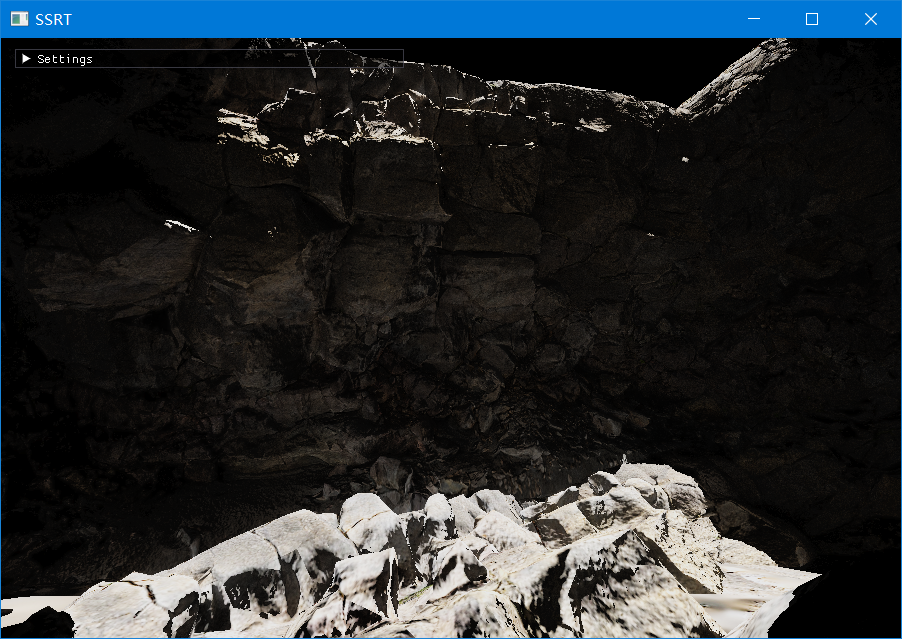
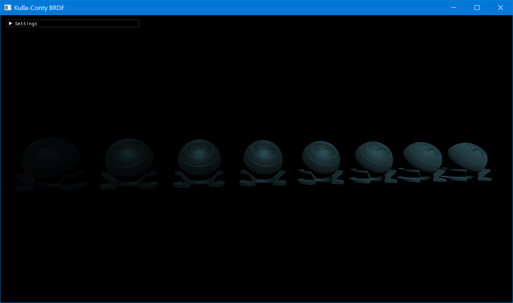
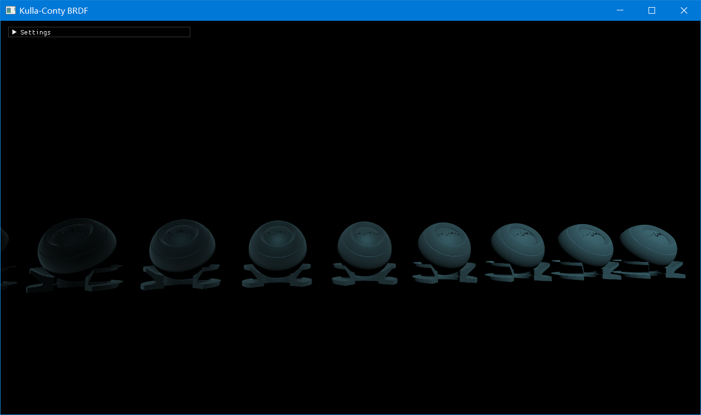

## Games202
使用C++/OpenGL实现Games202的前四个实时渲染相关的课程作业（学Javascript是不可能的）

### 作业1 ShadowMap
* Hard
* PCF
* PCSS

### 作业2 PRT
* 环境光的球谐系数旋转
* 间接光的球谐系数

### 作业3 SSRT
* 屏幕空间全局漫反射光照模型 
* 在View空间下线性RayMarching 
* 在NDC空间使用mipmap加速

### 作业4 KullaContyBRDF
关闭BRDF能量补偿

开启BRDF能量补偿
